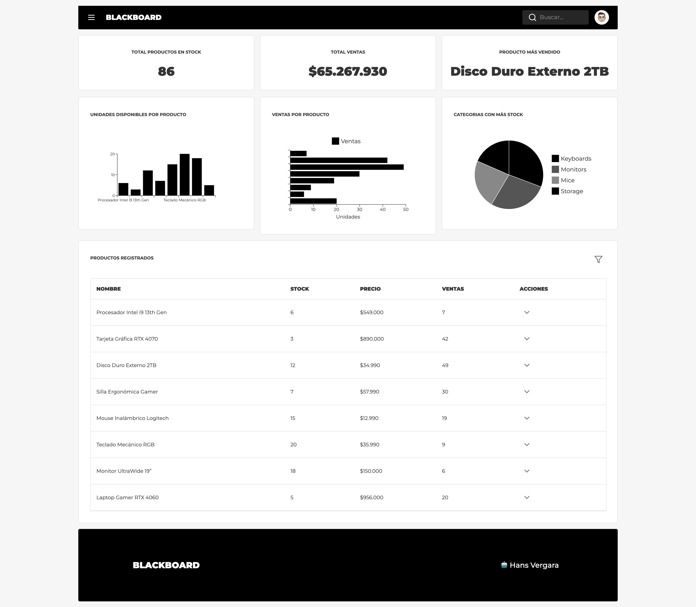

# Dashboard Frontend (ReactJS + MUI)

[](https://react.dev/)
[](https://zustand-demo.pmnd.rs/)
[](https://mui.com/)

Aplicación web para visualización y gestión de productos mediante un dashboard interactivo con capacidades CRUD.

 <!-- Si tienes imagen de preview -->

## ✨ Características Principales

- **Dashboard Analítico**

  - Indicadores clave (KPIs) con visualización de datos resumidos
  - Gráficos estadísticos usando MUI X Charts
  - Visualización responsiva adaptada a diferentes dispositivos

- **Gestión de Productos**

  - Tabla interactiva con filtros
  - Operaciones CRUD completas:
    - Crear nuevos productos (via menú lateral)
    - Editar productos existentes (modal in-place)
    - Eliminar productos con confirmación
  - Validación avanzada de formularios

- **UX Avanzado**
  - Menú lateral colapsable
  - Notificaciones del sistema (éxito/error)
  - Iconografía moderna con Lucide Icons
  - Carga optimizada y estados de espera

## 🛠 Stack Tecnológico

| Tecnología         | Uso                                        | Versión |
| ------------------ | ------------------------------------------ | ------- |
| React + TypeScript | Core de la aplicación                      | 18.2.0  |
| Vite               | Bundler y entorno de desarrollo            | 6.1.0   |
| MUI (Material-UI)  | Componentes UI y sistema de diseño         | 6.4.3   |
| MUI X Charts       | Visualización de gráficos (bar, line, pie) | 7.25.0  |
| Zustand            | Gestión de estado global                   | 5.0.3   |
| react-hook-form    | Manejo de formularios con validación       | 7.54.2  |
| Lucide React       | Iconografía moderna                        | 0.474.0 |
| Axios              | Cliente HTTP para API calls (si aplica)    | 1.7.9   |

## 🧠 ¿Por qué Zustand en lugar de Redux Toolkit?

Despues de haber trabajando en varios proyectos con redux, nunca me senti comodo con su implementación (espero que les pase lo mismo), hasta que conoci zuztand, que una vez instalado se genera un hook y ya se puede comenzar a utilizar, es por eso que La elección de Zustand se basa en:

- **Simplicidad**: Setup inicial en ~5 líneas de código vs configuración compleja de Redux (store, slices, providers)
- **Cero Boilerplate**: Elimina la necesidad de action types, dispatchers y reducers
- **Rendimiento**: Actualizaciones selectivas de estado con memoización automática
- **Tamaño**: 1.5kB vs 7.6kB de Redux Toolkit + React-Redux
- **Flexibilidad**: Acceso al store desde cualquier componente sin necesidad de providers
- **TypeScript Nativo**: Tipado fuerte sin configuración adicional
- **Patrón de actualización**: API similar a useState para rápida adopción

(espero que esta decisión no afecte la evaluación)

Acá un ejemplo de store:

```tsx
import { create } from "zustand";

type ProductStore = {
  products: Product[];
  addProduct: (product: Product) => void;
  fetchProducts: () => Promise<void>;
};

export const useProductStore = create<ProductStore>((set) => ({
  products: [],
  addProduct: (product) =>
    set((state) => ({ products: [...state.products, product] })),
  fetchProducts: async () => {
    const response = await api.get("/products");
    set({ products: response.data });
  },
}));
```

## 📂 Estructura del Proyecto

```
src/
├─ api/
├─ assets/
├─ common/
│  ├─ constants/
│  ├─ hooks/
│  ├─ interfaces/
│  ├─ utils/
│  └─ zod/
├─ components/
│  ├─ AlertDialog/
│  ├─ Charts/
│  ├─ DataGrid/
│  ├─ EmptyState/
│  ├─ Footer/
│  ├─ Indicator/
│  ├─ MainMenu/
│  ├─ MenuAction/
│  ├─ Modal/
│  ├─ NavBar/
│  └─ ProductForm/
├─ layout/
├─ routes/
├─ services/
├─ theme/
├─ App.tsx
├─ index.css
├─ vite-env.d.ts
└─ main.tsx

```

## 🚀 Instalación

1. Clonar repositorio:

   ```bash
   git clone https://github.com/hsvchcl/blackboard-frontend.git
   ```

2. Instalar dependencias:

   ```bash
   npm install
   # o
   yarn
   ```

3. Variables de entorno (crear .env):

   ```env
   VITE_API_URL=http://localhost:3010/api/v1
   ```

4. Iniciar servidor de desarrollo:
   ```bash
   npm run dev
   ```

## 📌 Scripts Disponibles

| Comando           | Descripción                          |
| ----------------- | ------------------------------------ |
| `npm run dev`     | Inicia servidor de desarrollo (Vite) |
| `npm run build`   | Crea build para producción           |
| `npm run preview` | Previsualiza build localmente        |
| `npm run lint`    | Ejecuta linter (ESLint)              |

## 🤝 Contribución

1. Haz fork del proyecto
2. Crea tu branch (`git checkout -b feature/nueva-funcionalidad`)
3. Commit cambios (`git commit -m 'Add nueva funcionalidad'`)
4. Push al branch (`git push origin feature/nueva-funcionalidad`)
5. Abre un Pull Request


